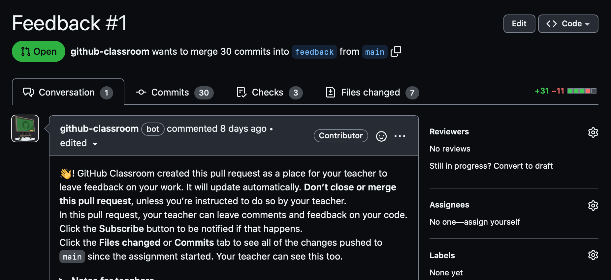

# Basic programming

Below you will find programming exercises of increasing complexity. Each exercise has a corresponding Python file in the `src/` directory that you should modify.

Do not worry if you do not get through all of the exercises. I have tried to cover a wide range of difficulties, so there is a challenge for those who have never programmed before and those who already have some experience. Make it as far as you can, and don't sweat it if it isn't everything.

Give each exercise a go, though, because sometimes you can get stuck on a medium-hard problem and still handle a harder one, simply because the difficulty is highly subjective.

Don't forget that you can get help by writing a comment in the `Feedback` pull request that tags me (@mailund). However, since my time is limited and I am teaching two and a half courses this term, responses might be slow for weekly exercises. I will get to it, but it can take a little while, so make sure that you are properly stuck before you give up and ask for help.

You might be able to get faster feedback from your fellow students. They can see your `Feedback` pull request as well, if you give them the URL to your repository, so you might consider that. If you do, you should also offer to review their code as well.

You can also formally ask for a review on GitHub. If you go to your `Feedback` pull request and look at the right side-bar, you should see "Reviewers" at the top.



If you click the gear icon, you get a drop-down with the GitHub handles of your fellow students (and me).


You can pick someone there--*after you have checked that they are okay with this*--and ask for a review. Then they will be notified by GitHub.

This, of course, might be overkill for weekly exercises, but I suggest you consider it for the mandatory projects. Having another set of eyes looking at your code can be a great help.

Anyway, let's get started with the exercises...

## Hello, World!

It is tradition, when you start programming or when you start learning a new programming language, that the first program you write is one that prints the string `"Hello, World!"` to the terminal.

We will not break this tradition, and anger the programming gods, so change the code in `src/hello.py` so it prints that exact string.

When you have done so, you can commit the changes to GitHub, push them, and check if the test for this exercise is now passing. You can check this either under `Actions` on the repository home page, or under the `Feedback` pull request.

## Loops

### Exercise

Assume you have a number `n` (in `src/hello-n.py` you get it from the user running the program).

```python
n = int(input("How many times should I loop? "))
```

Now write a loop that prints "Hello, World!" `n` times. You choose if you prefer a `for`- or a `while`-loop.

When you are done, you can check if the test script on GitHub agrees by committing and pushing, then checking the test on your `Feedback` pull request.


### Exercise

Let us do a `while`-loop that continues to ask us `"Do you want to stop?"` until you tell it that you want to stop. You can use the function `input()` to get user input. It lets the user write an answer on the terminal prompt, and once he or she hits enter, Python get the string. So you can ask the user if you should stop using

```python
input('Do you want to stop? ')
```

Write a `while`-loop that asks the use if you should stop in each iteration, and make it stop if the user answers `'yes'`. Remember that you can tell Python to stop iterating with the keyword `break`.

When you are done, you can check the test on your pull request (but mind you that it is only considering the program correct if it is getting *exactly* the same output, including spaces and newlines).

### Exercise

In `src/print-1-10.py`, write a loop that runs through the numbers 1 to 10 (not 0 to 9!), and prints the number.


### Exercise

Now write a new version, put it in `src/print-1-10-growing.py`, where we add a little more to each line; we will add the numbers from 1 up to and including the number we printed before. In iteration one the program should print `1`, in iteration two it should print `1 2`, in iteration three it should print `1 2 3`, and so forth. The final output should look like this,

```
1
1 2
1 2 3
1 2 3 4
1 2 3 4 5
1 2 3 4 5 6
1 2 3 4 5 6 7
1 2 3 4 5 6 7 8
1 2 3 4 5 6 7 8 9
1 2 3 4 5 6 7 8 9 10
```

with no spaces after the last letter.


### Exercise

Write a program to construct the following pattern:

```
*
* *
* * *
* * * *
* * * * *
* * * *
* * *
* *
*
```

(there are no spaces at the end of the lines, but there are between the `'*'`).

Create a new file for it, `src/pattern.py`. On GitHub, there is a test waiting for the new Python program.


## Lists

Consider a list such as this:

```python
x = [1, 2, 3, 4, 5, 6]
```

The following exercises involve manipulation of these. In the file `src/lists.py` I have written some template code that reads a list of space-separated integers

```
1 2 3
4 5
6
```

from standard input and you should modify the file with your solutions to the problems below. While working on the exercises, however, it might be easier to just define a list directly in Python, as above.


### Exercise

Write a loop over `x` that computes the sum of the numbers in `x`. Then write code to compute the mean of the numbers in `x`. In `src/lists.py`, compute the mean of `x` above the line that reads

```python
    print(mean)
```

### Exercise

Write a loop over the list `x` that creates another list, `times_three`, that contains the elements in `x` but multiplied by 3. In `src/lists.py`, compute the `times_three` list above the line that reads

```python
    print_list(times_three)
```

### Exercise

Write a loop that creates a list, `even`, that contains all even numbers in `x` (and only the even numbers). You can check if a number is even by taking the integer division remainder with two and checking if it is zero: `n % 2 == 0`. In `src/lists.py`, compute the `even` list above the line that reads


```python
    print_list(even)
```


## Counting

We use dictionaries for tables, and you can make an empty dictionary like this:

```python
table = {}
```

### Exercise

Write code that counts how often a character is in a string. You can iterate through a string, character by character, using

```python
for c in string:
	# process the character c
```

You can then use a table to count the characters. You can increment a count using

```python
table[c] += 1
```

but you will get an error if the character isn’t in the table. But, you can check if a character is not in the table with

```python
if c not in table:
	# handle this case
```

If you insert `c` here, you avoid the problem. Go count the characters in a string.

In `src/count.py` there is code for reading a string from standard input and writing the character count to standard output--it just needs your code to get working!


## Password validation

Write program to check the validity of password input by users.

* At least 1 letter between `[a-z]` and 1 letter between `[A-Z]`. You can use the methods `a.islower()` and `a.isupper()` to check if the letter `a` is one of these.
* At least 1 number between `[0-9]`. You can use the method `a.isnumeric()` for this.
* At least 1 character from `[$#@]`; (`a in "$#@"` will test if `a` is one of these).
* Minimum length 6 characters.
* Maximum length 16 characters.

The program in `src/password.py` is set up and ready to go, but you need to implement the password checks for it.


## Hex encoding

This exercise is a little more involved. We want to create a textual representation for strings of bytes—it is something that was once necessary to send binary files over email (and might still be, but I have lost track of the various internet protocols). A byte is an 8-bit number, but we will use characters in Python strings (they are a little more complex, but for the exercise it doesn’t matter). If you have a character in Python, you can get the corresponding number using the function `ord()`. For example

```python
print(ord('a'))
```

will print 97. Python uses so-called *unicode* to represent strings, and the number you get is the integer that the unicode standard assigns to that character. Anyway, it doesn’t matter. What matters is that we have a mapping from characters to numbers, and we can get the number for a character using `ord()`.

You can go the other way using the function `chr()`, so

```python
print(chr(ord('a')))
```

gives you `a` back. So to translate a string of bytes into something human readable, we can go through it, get the underlying numbers out (using `ord()`) and that gives us a string that we can send with an old email program. If you want to get the original string back, you run though it and translate back with `chr()`.

Well, not that fast! If you see the string `123` do you have three, two, or one number? `1`, `2`, and `3`? or `12` and `3` ? or `1` and `23`? or `123`? For the trick to work, we need some way to delimit the characters. What people did (and might still do) is to translate the numbers into hexadecimal, which is base-16 numbers. You can encode more numbers in less space that way, and you can recognise when a number starts because it will always start with `0x`. You can get the hexadecimal string from a number using the function `hex()`.


### Exercise

Take a string such as

```python
x = "abcdabc"
```

and run through each character, get its number, and put the hex encoding into a list. Once you have the list, `y`, you can create the corresponding string using

```python
z = ''.join(y)
```

In `src/hex.py`, implement the encoding above the line that says

```python
    print(encoding)
```

## Hex decoding


There is no particular reason to prefer hexadecimal (except that two hex-numbers is enough to encode all bytes). You could use any textual encoding, you could use any delimiter, or you could require that all the numbers had the same number of digits. They avoided the latter because numbers that start with zero are interpreted as octal in the programming language C, which was used for most programs at the time. Anyway, this is how you would encode a string of bytes into a textual representation that wouldn’t confuse old email programs.

However, encoding is not the full story. If I send you an encoded file, you probably want to decode it again. You need the real string of bytes, and that is not what I am sending you. So, you need to go through the string and translate the numbers back—first you need to get an `int` for each hexadecimal number, and then you need to translate that number into the original character (the last step, we already know that we can do with the `chr()` function).

You can split the string of hexadecimal numbers, `x` using 

```python
x.split('0x')
```

It gets rid of the `0x` strings and give you a list of the strings between them. Throw away the first element, it is an empty string and doesn’t represent a number. You can run through this list and translate the strings into integers. You need to interpret the strings as hexadecimal (and not for example decimal), so call the function `int` with an extra argument, `base = 16`. If `n` is a string in hexadecimal, then 

```python
int(n, base = 16)
```

gives you the underlying number, that you can then give to `chr()`.

### Exercise

Write code that takes a string of hexadecimal strings and decode it into the original string. Add it to `src/hex.py` above the line that says

```python
    print(decoding)
```

Now you have both an encoding and a decoding, and you can check if it works by going full circle. In the `bash` shell, this

```bash
> python3 src/hex.py decode $(python3 src/hex.py encode foobar)
```

should print `foobar`. The command `$(python3 src/hex.py encode foobar)` encodes `foobar` and gives it as a string argument to the second argument that decodes it again.


There are other (and smarter) encodings. Now that we have mostly moved to unicode for text representations, there are many options for simple text, and for binary files there has always been many. They are optimised for different things and for different applications, so you run into them every day, without knowing them. One day, perhaps, you will need to write your own encoders and decoders—it is quite likely if you ever need to develop your own file format—and now you have seen a very simple solution.

